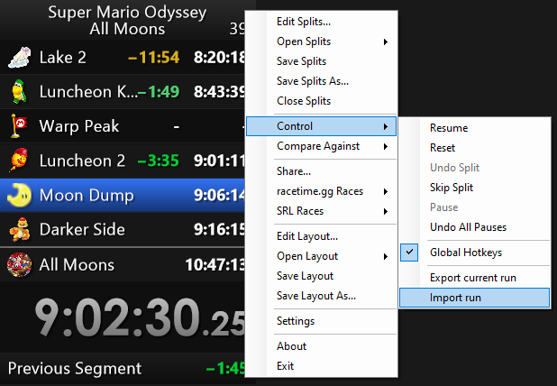

# What is LiveSplit.TimeAttackPause?
A simple LiveSplit component to save your splits mid run and continue with them later.
It is intended to be used for long RTA or marathon runs where you can not finish the run in one sitting.
You can save the state of your splits at any time to a readable json file and load them again later.

# &#9888; Disclaimer
Do not use this component for RTA runs that are intended to be submitted to speedrun.com.
Almost in every game speedrun community it is not allowed to pause your timer during a RTA run.  
Even for TA runs you should check the rules first or ask the community if it is allowed to use this for runs you want to submit.  
I am not responsible for any runs that get rejected because you used this component.  
However of course feel free to use it for your own runs that you do not want to submit to any leaderboard.

# How to use it?
1. Download the dlls from the latest release on the [releases page](https://github.com/Shotnex4/LiveSplit.TimeAttackPause/releases) and put them in your LiveSplit/Components folder.
2. Add the component to your layout. (Right click &rarr; Edit Layout &rarr; Timer &rarr; TimeAttackPause)
3. Start your run and pause your timer at any time.
4. Click on the "Export" button in the component to save your splits to a json file.
5. Now you can close LiveSplit. Shut down your PC. Go to sleep. Whatever you want.
6. When you are ready to continue your run, open LiveSplit again and load your splits by clicking on the "Import" button in the component.

